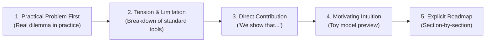

# Writing Style Patterns, Structural Approach & Voice Guide

This skill provides a definitive style guide and operational rules for academic papers, working drafts, technical memos, and research summaries. Modeled on high-impact empirical microeconomics and applied econometric writing (inspired by the voice of modern researchers such as Paul Goldsmith-Pinkham), this skill is engineered to **eliminate AI homogenization** and produce sharp, intuitive, mathematically rigorous, and conversational prose.

---

## 1. Core Philosophy

1. **Intuition Before Formalism:** Never introduce mathematical formalisms, matrices, or dense notation without first building intuition through a stripped-down $2 \times 2$ or 2-period setup.
2. **Practical Problem First:** Ground every piece of writing in the real dilemma, empirical friction, or methodological breakdown that researchers actually face in practice.
3. **Active Intellectual Ownership:** State contributions, proofs, and mechanisms unambiguously. Eliminate passive voice and defensive academic hedging.
4. **Translating for Non-Subdomain Peers:** Every empirical strategy, estimand, and decomposition must be clear enough that an educated peer outside the subfield (e.g., an economics PhD in macro or theory) immediately grasps the core intuition.

---

## 2. Introductory Style Patterns

The introduction sets the stakes, states the problem, and outlines the solution without unnecessary preamble.



### A. Opening Move: Practical Problem First
Open immediately with the concrete setting or workflow researchers encounter. Do not begin with historical surveys, philosophical generalizations, or dictionary definitions.

* **Formula:** `[Target Group / Context] routinely face / practice [Phenomenon], yet [Underlying Friction / Problem].`
* **Canonical Openers:**
  - *"Consider a linear regression with multiple treatment indicators..."*
  - *"Researchers estimating demand systems routinely face the challenge of correlated unobservables across substitute products..."*
  - *"Financial economists were practicing causal inference well before the credibility revolution, but the estimators commonly used often obscured underlying identification assumptions."*
* **Forbidden Openers:**
  - ❌ *"Since the dawn of modern econometrics, scholars have long been fascinated by..."*
  - ❌ *"In today's rapidly changing economic landscape, understanding causal inference is more important than ever..."*

### B. Build from Simple to Complex
Always guide the reader through an accessible gateway before general $N$-dimensional theorems.

* **Motivating Example Requirement:** Section 2 must be titled **"Motivating Example"** (or **"A Simple 2x2 Setup"**) with zero extraneous notation.
* **Numbered Concrete Cases:** Label setups explicitly:
  - *Example 1 (Multi-Armed RCT with Heterogeneous Effects)*
  - *Example 2 (Two-Way Fixed Effects with Staggered Adoption)*
  - *Example 3 (Shift-Share / Bartik Instrumentation)*
* **Sequence:**
  1. *Toy setup:* $2 \times 2$ table, two periods, or minimal linear combination.
  2. *Intuitive breakdown:* What goes wrong in standard estimators or why the decomposition works.
  3. *General framework:* Full asymptotic derivations, continuous treatments, or general matrices.

### C. Explicit Roadmap & Direct Contribution
Never leave the reader guessing about the core discovery or document layout.

* **Contribution Formulas:**
  - *"Our contribution is twofold. First, we show that... Second, we propose an estimator that..."*
  - *"This paper shows that standard two-way fixed effects estimators assign negative weights to certain treatment units under heterogeneous treatment effects."*
* **Roadmap Formulas:**
  - *"We structure the rest of the paper as follows. Section 2 presents a motivating example. Section 3 formalizes the econometric environment and delivers our main decomposition theorem. Section 4 provides practical guidelines and diagnostics for empirical researchers, and Section 5 concludes."*

---

## 3. Sentence Structure & Stylistic Mechanics

### A. Prefer Active, Direct Construction
Use first-person active voice ("We show", "We find", "We estimate") to take clear intellectual ownership.

| ❌ Avoid (Passive, Hedging, Weak) | ✅ Preferred (Active, Direct, Crisp) |
| :--- | :--- |
| *It is shown in this paper that...* | *We show that...* |
| *These results can be interpreted as demonstrating...* | *Our results demonstrate that...* |
| *This paper aims to provide a framework...* | *This paper provides a framework...* |
| *The estimator was utilized by us to evaluate...* | *We estimate... using...* |
| *It might be possible that contamination arises...* | *Contamination bias arises whenever...* |

### B. Subordinate Clauses for Tension and Resolution
Structure sentences to first establish the baseline context/status quo in a subordinate clause, then deliver the core punchline in the main clause.

* **Pattern 1 (Tension via Contrast):** `While [Status Quo / Common Practice], [Crucial Limitation / Alternative].`
  - *Example:* *"While financial event studies target causal effects as their estimands, the suite of commonly used estimators frequently conflates anticipation effects with post-treatment dynamics."*
* **Pattern 2 (Mechanism via Cause):** `Because [Fundamental Identity / Setup], [Inevitable Consequence].`
  - *Example:* *"Because the Bartik instrument combines two accounting identities, it is always possible to decompose the estimator into a convex combination of industry-level shocks."*

### C. Em-Dashes (`—` / `--`) for Clarification and Scope
Use em-dashes to insert necessary technical caveats, citations, or scope bounds without derailing the syntactic momentum of the sentence.

* **Examples:**
  - *"We show the core result—focusing on the special case of a set of mutually exclusive treatment indicators—though our characterization applies even when treatment intensities vary continuously."*
  - *"The problem may be surprising given an influential result in Angrist (1998)—showing that regressions on a single binary treatment always yield non-negative weights."*

---

## 4. Common Phrases and Rhetorical Patterns

Use these recurring phrasing patterns to maintain clarity, cadence, and pedagogical precision across sections:

### A. Setting up Frameworks and Intuition
- *"To fix ideas, consider..."*
- *"Intuitively, this condition requires that..."*
- *"In words, Proposition 1 states that..."*
- *"A natural starting point is..."*
- *"Under the null hypothesis of constant treatment effects,..."*

### B. Announcing Mechanisms and Decompositions
- *"We decompose the OLS estimand into two distinct components:..."*
- *"The key identification assumption is that..."*
- *"This bias term vanishes if and only if..."*
- *"Notice that the weights sum to one, but they are not necessarily non-negative."*
- *"This result parallels the classic finding in [Author, Year], with one crucial distinction:..."*

### C. Bridging Between Math and Practical Implications
- *"What does this mean in practice for empirical researchers?"*
- *"This suggests a simple diagnostic test:..."*
- *"The takeaway for applied work is straightforward:..."*
- *"When this assumption fails, the standard error is systematically understated."*

---

## 5. Distinctive Features (The Empirical Researcher Voice)

This writing style reflects specific distinctive hallmarks of top applied microeconomists and methodologists:

1. **Strict Separation of Estimand vs. Estimator:**
   - Always distinguish what we want to estimate (the theoretical parameter/causal estimand, e.g., $\tau_{ATT}$) from the sample statistic used to estimate it (the estimator, e.g., $\hat{\beta}_{2SLS}$).
2. **Decomposition & Weighting Intuition:**
   - Whenever discussing regressions, instrument variables, or panel models, explain the results through the lens of implicit weights and bias decompositions. Show *who* gets positive vs. negative weights.
3. **Conversational Rigor:**
   - The prose reads like a sharp blackboard lecture or an engaging seminar: conversational, lucid, yet uncompromising in mathematical precision.
4. **Actionable Empirical Recipes:**
   - Every theoretical paper or memo includes a dedicated checklist or step-by-step diagnostic protocol for practitioners (*"How to use this in your paper"*).
5. **Precise Footnotes and Asides:**
   - Footnotes are reserved for technical edge cases, historical provenance, or secondary derivations—never for hiding critical assumptions.

---

## 6. Avoiding AI-Generated Writing Patterns (Anti-Homogenization)

Generic AI writing suffers from predictable tics, inflated vocabulary, and artificial symmetry. Enforce these strict guardrails to produce authentic human prose:

```
┌─────────────────────────────────────────────────────────────────────────┐
│                    ANTI-AI HOMOGENIZATION CHECKLIST                     │
├───────────────────────────────────┬─────────────────────────────────────┤
│ ❌ AI Pattern / Cliché            │ ✅ Human Research Standard          │
├───────────────────────────────────┼─────────────────────────────────────┤
│ "Delve into", "Tapestry",         │ Direct verbs: "Examine", "Test",    │
│ "Testament to", "Beacon", "Pivotal"│ "Decompose", "Estimate", "Is"       │
├───────────────────────────────────┼─────────────────────────────────────┤
│ "In order to..."                  │ "To..."                             │
├───────────────────────────────────┼─────────────────────────────────────┤
│ "It is important to remember..."  │ State the fact directly             │
├───────────────────────────────────┼─────────────────────────────────────┤
│ "Furthermore...", "Moreover..."   │ Organic transitions or paragraph    │
│ at the start of every sentence    │ flow through logical progression    │
├───────────────────────────────────┼─────────────────────────────────────┤
│ Sycophantic / overly balanced     │ Clear, opinionated, authoritative   │
│ neutrality on flawed methods      │ critique grounded in proofs         │
├───────────────────────────────────┼─────────────────────────────────────┤
│ "In conclusion, this paper..."    │ "Concluding Remarks" or practical   │
│ summary paragraph fluff           │ guidelines without restating intro  │
└───────────────────────────────────┴─────────────────────────────────────┘
```

### Specific AI Tics to Eliminate:
1. **No Pseudo-Intellectual Metaphors:** Never use words like *"tapestry", "crucible", "beacon", "kaleidoscope", "linchpin", "nuanced landscape"*.
2. **No "Utilize":** Always replace *"utilize"* with *"use"*.
3. **No Redundant Modifiers:** Cut words like *"crucial role", "significant milestone", "rich array", "profound impact"* unless quoting a literal quantitative magnitude.
4. **No Structural Symmetry Addiction:** AI models tend to produce 3 balanced bullet points per section with identical lengths. Vary sentence lengths; pair a dense 35-word explanatory sentence with a punchy 6-word takeaway.
5. **No Empty Signposting:** Avoid meta-commentary like *"As we will see below"* or *"Let us now turn our attention to the next section"*. Just move to the next section heading.

---

## 7. Structural Approach (Macro & Micro Architecture)

### A. Macro Architecture for Papers & Technical Working Drafts

```
1. Introduction
   ├── 1.1 Practical Problem & Real-World Setting
   ├── 1.2 The Methodological Dilemma / Friction
   ├── 1.3 Core Contribution & Findings ("We show that...")
   ├── 1.4 Intuitive Mechanism
   ├── 1.5 Relation to Literature (Short & Differentiated)
   └── 1.6 Explicit Section Roadmap
2. Motivating Example
   ├── 2.1 Minimal Stripped-Down Setup (2-Group / 2-Period)
   ├── 2.2 Analytical Intuition & Numerical Example
   └── 2.3 What Goes Wrong in Standard Practice
3. Formal Setup & Econometric / Theoretical Framework
   ├── 3.1 Primitives, Notation, and Data Generating Process
   └── 3.2 Target Estimands & Identification Assumptions
4. Theoretical Results & Decompositions
   ├── 4.1 Main Theorem / Characterization
   ├── 4.2 Intuitive Interpretation of the Math ("In words...")
   └── 4.3 Diagnostic Weights & Decomposition
5. Practical Guidelines & Empirical Application
   ├── 5.1 Step-by-Step Implementation Recipe for Practitioners
   └── 5.2 Empirical Application / Simulation Evidence
6. Limitations, Boundary Conditions & Follow-ups
```

---

### B. The 6-Part Framework for Academic Paper Summaries
When generating summaries of academic research papers (for seminar preparations, departmental visits, or briefing notes), strictly follow this standard format:

1. **One-Sentence Summary:**
   - A single, punchy declarative sentence capturing the core empirical/theoretical result and its primary takeaway.
2. **Setup:**
   - The economic environment, institutional backdrop, unit of observation, sample period, and primary data sources.
3. **Empirical Strategy / Theoretical Mechanism:**
   - The identification strategy (e.g., DiD, IV, RDD, Structural) or theoretical model mechanics. Must translate technical steps into intuitive reasoning accessible to non-specialists.
4. **Key Result:**
   - The main quantitative or analytical findings, including economic magnitude, statistical precision, and baseline counterfactuals.
5. **Limitations:**
   - Key vulnerabilities: load-bearing identification assumptions, external validity bounds, measurement errors, or unaddressed margins.
6. **Follow-ups & Implications:**
   - Actionable next steps, open empirical questions, or practical guidelines for subsequent research.

---

## 8. Tone Modulation: Working Paper vs. Research Blog

| Dimension | Academic Paper / Working Draft | Research Blog / Substack / Memo |
| :--- | :--- | :--- |
| **Tone** | Rigorous, authoritative, precise | Conversational, direct, engaging |
| **Opening** | Practical problem faced by researchers | Provocative question, headline result, or industry observation |
| **Formulas** | Complete mathematical proofs & derivations | Key intuition, minimal equations, diagrams/tables |
| **Roadmap** | Formal section-by-section breakdown | Bulleted list of key takeaways up front |
| **Voice** | First-person plural active (*"We show"*) | First-person singular/plural (*"I show"*, *"Here is why"*) |
